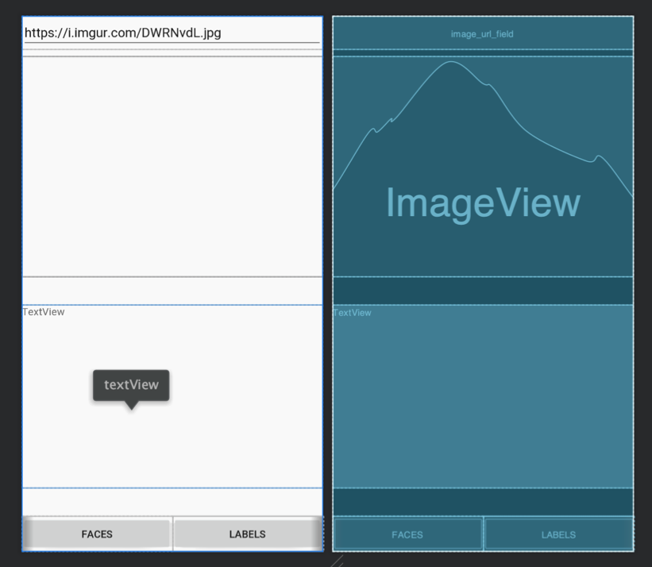
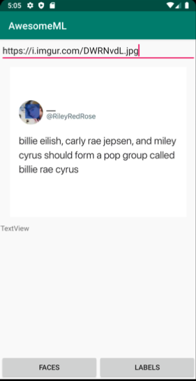

# MLKit with Android

### SharedPreferences

1. Create an Android Project

    Create an Android Project named AwesomeML with an Empty Activity.

2. Add dependencies to project

    After the connection has been established successfully, make sure you press the Add Analytics to your app button to add various core MLKit dependencies to your app module's build.gradle file.

    Next, to actually add the ML Kit library, open the build.gradle file and type in the
    following implementation dependencies:

    ```gradle
    dependencies { 
        ...
        implementation 'com.squareup.picasso:picasso:2.71828' 
        implementation 'com.google.mlkit:face-detection:16.0.6' 
        implementation 'com.google.mlkit:image-labeling:17.0.3'
    }
    ```

3. Edit the AndroidManifest.xml, to add internet connection permission and meta-data tag to prioritise the download of the ML model to your app.

    ```xml
    <?xml version="1.0" encoding="utf-8"?>
    <manifest xmlns:android="http://schemas.android.com/apk/res/android"
        package="shape.coventry.awesomeml">

        <uses-permission android:name="android.permission.INTERNET" />

        <application
            android:allowBackup="true" 
            android:icon="@mipmap/ic_launcher" 
            android:label="@string/app_name" 
            android:roundIcon="@mipmap/ic_launcher_round" 
            android:supportsRtl="true" android:theme="@style/AppTheme">

            <activity android:name=".MainActivity">
                <intent-filter>
                    <action android:name="android.intent.action.MAIN" />
                    <category android:name="android.intent.category.LAUNCHER" /> 
                </intent-filter>
            </activity>

        <meta-data android:name="com.google.mlkit.vision.DEPENDENCIES" 
            android:value="face, label" />

        </application>
    ```

4. Define a Layout 

    Edit the layout_main.xml to build a layout for working with MLKit.

    ```xml
    <?xml version="1.0" encoding="utf-8"?>
    <androidx.constraintlayout.widget.ConstraintLayout 
        xmlns:android="http://schemas.android.com/apk/res/android"
        xmlns:app="http://schemas.android.com/apk/res-auto" 
        android:id="@+id/relativeLayout2" 
        android:layout_width="match_parent" 
        android:layout_height="match_parent">
        
        <EditText
            android:id="@+id/image_url_field" 
            android:layout_width="match_parent" 
            android:layout_height="wrap_content" 
            android:hint="Image URL" 
            android:imeOptions="actionDone"
            android:inputType="textUri" 
            android:text="https://i.imgur.com/DWRNvdL.jpg" app:layout_constraintStart_toStartOf="parent" 
            app:layout_constraintTop_toTopOf="parent" />

        <ImageView
            android:id="@+id/image_holder" 
            android:layout_width="match_parent" 
            android:layout_height="300dp" 
            android:layout_below="@+id/image_url_field" 
            android:layout_marginTop="10dp" 
            android:scaleType="centerInside" 
            app:layout_constraintStart_toStartOf="parent" 
            app:layout_constraintTop_toBottomOf="@+id/image_url_field" />

        <LinearLayout
            android:id="@+id/bottomLayout" 
            android:layout_width="match_parent" 
            android:layout_height="wrap_content" 
            android:orientation="horizontal"
            app:layout_constraintBottom_toBottomOf="parent" app:layout_constraintStart_toStartOf="parent">

            <Button
                android:layout_width="0dp" 
                android:layout_height="wrap_content" 
                android:layout_weight="0.33" 
                android:onClick="detectFaces" 
                android:text="Faces" />

            <Button
                android:layout_width="0dp" 
                android:layout_height="wrap_content" 
                android:layout_weight="0.33" 
                android:onClick="generateLabels" 
                android:text="Labels" />

        </LinearLayout>
        <TextView
            android:id="@+id/textView" 
            android:layout_width="match_parent" 
            android:layout_above="@+id/bottomLayout" 
            android:layout_below="@+id/image_holder" 
            android:layout_marginTop="0dp" 
            android:layout_marginBottom="1dp" 
            android:text="TextView" 
            app:layout_constraintBottom_toTopOf="@+id/bottomLayout" app:layout_constraintStart_toStartOf="parent" 
            app:layout_constraintTop_toBottomOf="@+id/image_holder" 
            android:layout_height="250dp" />
    </androidx.constraintlayout.widget.ConstraintLayout>
    ```

    Here’s a more visual presentation of the layout:



5. Go to MainActivity.java, add the function which link with the onClick attributes of button:
    
    ```kotlin
    fun detectFaces(v: View?) {

    }

    fun generateLabels(v: View?) {
        
    }
    ```
    
6. Load an Image

    In MainActivity.java, define UI variable and load the UI component using findViewById(). Load the image from a URL when the “done” button of software keyboard is clicked.
    

    ```kotlin
    lateinit var image_holder: ImageView
    lateinit var image_url_field: EditText
    lateinit var textView: TextView

    override fun onCreate(savedInstanceState: Bundle?) {
        super.onCreate(savedInstanceState)
        setContentView(R.layout.activity_main)
        image_url_field = findViewById(R.id.image_url_field)
        image_holder = findViewById(R.id.image_holder)
        image_holder.setImageResource(R.drawable.ic_launcher_foreground)
        textView = findViewById(R.id.textView)
        //load image using Picasso API (Use https://, don’t use http://)
        image_url_field.setOnEditorActionListener(TextView.OnEditorActionListener { v, actionId, event ->
            if (actionId == EditorInfo.IME_ACTION_DONE) {
                Picasso.get().isLoggingEnabled = true
                Picasso.get().load(image_url_field.getText().toString()).into(image_holder)
                Log.i("awesomeML", "try load image")
            }
            Log.i("awesomeML", "load image")
            false
        })
    }

    ```
    
7. Detact Faces

    Add the following code to the detectFaces() method:

    ```kotlin
    val bitmap = (image_holder!!.drawable as BitmapDrawable).bitmap
    val image = InputImage.fromBitmap(bitmap, 0)
    val detector = FaceDetection.getClient()
    ```

    
8. By calling the detectInImage() method again and passing a bitmap to it, you can start the face detection process asynchronously. By using an OnSuccessListener instance attached to the Task object it returns, you can easily know when the process is complete.
    
    ```kotlin
    detector.process(image).addOnSuccessListener { faces ->

    }
    ```
Inside the listener, you'll have access to a list of Face objects, which contain the coordinates of rectangles that circumscribe the detected faces. So let us now draw those rectangles over a copy of the original image that was processed.   


9. In addOnSuccessListener() closure, you must use its copy() method as shown below to create a copy of the original image's bitmap. 
    
    ```kotlin
    val markedBitmap = (image_holder!!.drawable as BitmapDrawable).bitmap.copy(
        Bitmap.Config.ARGB_8888,
        true
    )
    ```
    
10. At this point, you can simply loop through the list of Face objects and use their boundingBox properties to draw rectangles over the detected faces.

    ```kotlin
    val canvas = Canvas(markedBitmap)
    val paint = Paint(Paint.ANTI_ALIAS_FLAG)
    paint.color = Color.parseColor("#99003399")
    ```
11. Next, to be able to draw on the new bitmap, you must create Canvas and Paint objects for it. Using a slightly transparent color for the rectangles would be ideal.

    ```kotlin
    for (f in faces) {
        canvas.drawRect(f.boundingBox, paint)
    }
    ```    
12. Next, to be able to draw on the new bitmap, you must create Canvas and Paint objects for it. Using a slightly transparent color for the rectangles would be ideal.

    ```kotlin
    runOnUiThread {
        Toast.makeText(this@MainActivity, "success", Toast.LENGTH_LONG).show()
        image_holder!!.setImageBitmap(markedBitmap)
    }
    ```        

    

13. Generate Labels

    To generate labels for an image, you must use either the local model-based ImageLabler
    class or the cloud model-based counterpart. Because we've been using only local models throughout this tutorial, let's use the cloud model now.
    Add the following code to the generateLabels() method:

    ```kotlin
    val bitmap = (image_holder!!.drawable as BitmapDrawable).bitmap
    val image = InputImage.fromBitmap(bitmap, 0)
    val laber = ImageLabeling.getClient(ImageLabelerOptions.DEFAULT_OPTIONS)
    ```

14. Next, as usual, call the detectInImage() method and assign an OnCompleteListener instance to its return value.

    ```kotlin
    laber.process(image).addOnSuccessListener { labels ->
        
    }

15. This time, inside the listener, you'll have access to a list of ImageLabel objects, each of which has a label property containing a potential label for the image. Each label also has a confidence property associated with it, specifying how sure ML Kit is about the label.
In addOnSuccessListener() closure, The following code shows you how to loop through the list of labels and generate an alert dialog displaying only those labels whose confidence scores are more than 70%.

    ```kotlin
    var labelText = "Result"
    for (label in labels) {
        val text = label.text
        val confidence = label.confidence
        labelText += "\n$text: $confidence"
    }
    val finalLabelText = labelText
    runOnUiThread { textView!!.text = finalLabelText }   
    ```   

    Go ahead and run the app again to see what labels your app generates for the images you throw at it.

    

# Conclusion
    With ML Kit, Google wants to make machine learning as accessible and mainstream as simpler tasks such as analytics and crash reporting. In this introductory tutorial, you learned how to work with some of its base APIs in Android apps. You also learned how to use both the cloud and local models it offers.