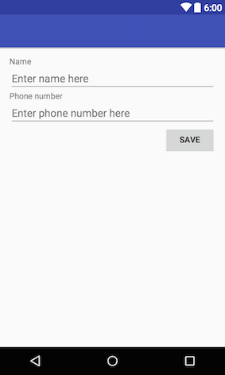
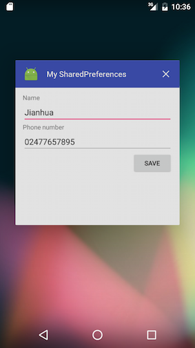
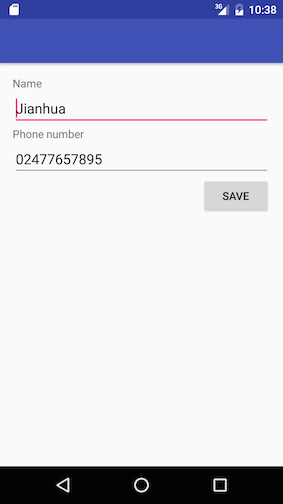
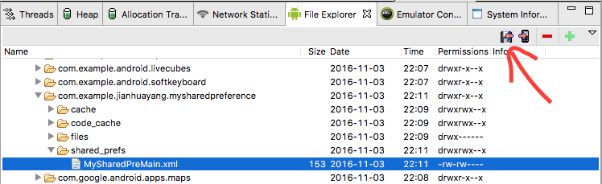
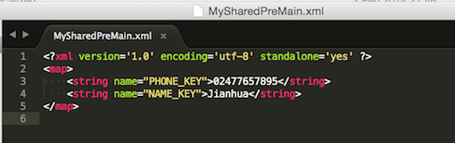
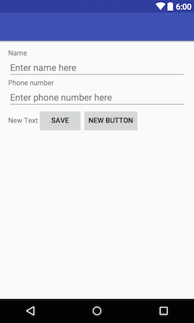
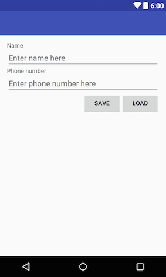
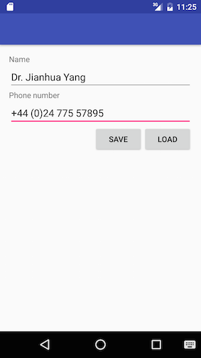

# Android Navigation

## Navigation

Navigation refers to the interactions that allow users to navigate across, into, and back out from the different pieces of content within your app. Android Jetpack's Navigation component helps you implement navigation, from simple button clicks to more complex patterns, such as app bars and the navigation drawer. The Navigation component also ensures a consistent and predictable user experience by adhering to an established set of principles.

Follow steps below to prepare the nav_graph xml file:

1. Start a new Android Studio project and name it 'NavigationEx' (Template: Empty Activity). At the project view, right-click the `res` folder and select `New > Android Resource File`.

2. In the New Resource File, type `nav_graph` for the File name, select `Navigation` for the Resource type:


3. Rich-click the src package, create two new fragments (Black Fragment), name them `FirstFragment` and `SecondFragment` respectively :


4. Edit the `nav_graph` xml file, add First Fragment and Second Fragment into the Navigation Graph. 


5. Select the First Fragment and make it the start destination. (The house icon)


6. Drag an action from First Fragment to Second Fragment, select create action, and name its it as `action_firstFragment_to_secondFragment`


3. In the `activity_main` xml file, revise the xml code in order to add NavHostFragment to the activity's layout.

```xml
<?xml version="1.0" encoding="utf-8"?>
<androidx.constraintlayout.widget.ConstraintLayout xmlns:android="http://schemas.android.com/apk/res/android"
    xmlns:app="http://schemas.android.com/apk/res-auto"
    xmlns:tools="http://schemas.android.com/tools"
    android:layout_width="match_parent"
    android:layout_height="match_parent"
    tools:context=".MainActivity">

    <androidx.fragment.app.FragmentContainerView
        android:id="@+id/fragmentContainerView"
        android:name="androidx.navigation.fragment.NavHostFragment"
        android:layout_width="0dp"
        android:layout_height="0dp"
        app:layout_constraintLeft_toLeftOf="parent"
        app:layout_constraintRight_toRightOf="parent"
        app:layout_constraintTop_toTopOf="parent"
        app:layout_constraintBottom_toBottomOf="parent"

        app:defaultNavHost="true"
        app:navGraph="@navigation/nav_graph" />

</androidx.constraintlayout.widget.ConstraintLayout>
```



Next, let's need to use SharedPreferences API to save some simple data.


    

    
3. Create a call-back method that responds to the click event of the only button in the XML. Don't forget the `commit()` method, which is similar to `commit()` in FragmentTransaction. You also need to update the xml file to associate the button with this method by inserting `android:onClick="save"` line.
    
    ```java
    public void save(View v){
        SharedPreferences.Editor editor = sharedPreferences.edit();
        editor.putString(NAME_KEY, editTextName.getText().toString());
        editor.putString(PHONE_KEY, editTextPhone.getText().toString());
        editor.commit();
        Toast.makeText(v.getContext(),"data saved",Toast.LENGTH_SHORT).show();
    }
    ```
   
4. Run the app and type in something, then click the 'Save' button. Close the app properly (i.e. through app switcher) and then re-open you'll the data is still there.
    
    
    
    
    
5. To actually see the file created, you'll need to run the app using an AVD and NOT your device (unless you root it). If in previous steps you use a real device, now switch to an AVD based on API 23 and save some data in the app. Click Tools ==> Android ==> Android Device Monitor to bring up the Android Device Monitor
    
    > It seems that latest Android APIs (24 and above) do not integrate well with [DDMS](https://developer.android.com/studio/profile/ddms.html), you will have to use an AVD that is based on Android 6.0 (API 23) or below. See [discussion on StackOverflow](https://stackoverflow.com/questions/34603355/android-device-monitor-data-folder-is-empty).
    
    In the File Explorer tab, go to Data ==> Data ==> com.example.jianhuayang.mysharedpreferences ==> shared_prefs folder, you'll see an XML file named 'MySharedPreMain.xml', which is the name you give earlier in the `getSharedPreference()` method. This is where your data are saved. Single-click on that xml file to select it, then click the Get Device File icon (the left-most icon in the toolbar) to export the file to your hard drive. 
    
    
    
    If you open the file in a text editor, you'll see the contents. Note that key-value pairs are being stored as explicit texts in it. (Explicit texts cannot be used to save sensitive data).
    
    
    
    > If you do it on a real device, you'll see that data folder is empty. That's because you don't have the admin a.k.a. root privileges to access contents in that folder. You can 'root' your device in a way similar to jailbreaking iPhones, but this is not recommended as it opens security holes. To see why you shouldn't root your device, read [the blog written by Srinivas](http://resources.infosecinstitute.com/android-hacking-security-part-9-insecure-local-storage-shared-preferences/), where SharedPreferences were used to manipulate game scores.

### Writing and reading to files

Instead of writing to an internal XML file using SharedPreferences API, you can also use the standard Java IO API to read/write files as if Android is a small PC. 

> In case you are new to Java I/O, have a look at [Java I/O Tutorials](https://docs.oracle.com/javase/tutorial/essential/io/) and [how to read data from InputStream into String in java](http://howtodoinjava.com/2013/10/06/how-to-read-data-from-inputstream-into-string-in-java/). 

Follow steps below to create a simple app that stores some data in a file.

1. Locate the 'My SharedPreferences' project you created earlier on your hard drive, make a copy of it and rename the new folder to 'MyFiles'.
2. Open 'MyFiles' project, in activity_main.xml, in the Design view drag and drop a LinearLayout (horizontal) before the Button. Make sure this LinearLayout has 'layout_width="match_parent"' and 'layout_height="wrap_content"'.
3. Switch to the  Text view, move the Button tag into this newly created LinearLayout.
4. Switch back to the design view, drag and drop another button to the right of the Save button, and a Plain TextView to the left of the Save button. Make your layout look like this:
    
    
    
5. Double click on the new button, change the text to Load, and id to load. 
6. Double click on the new TextView, delete the text so it becomes blank. Switch back to the text view and give this TextView a weight of 1, and width/height of '0dp'. The finished XML LinearLayout should look like below. 
    
    ```xml
    <LinearLayout
        android:layout_width="match_parent"
        android:layout_height="wrap_content"
        android:orientation="horizontal">

        <TextView
            android:id="@+id/textView"
            android:layout_width="0dp"
            android:layout_height="wrap_content"
            android:layout_weight="1"
            />

        <Button
            android:id="@+id/button"
            android:layout_width="wrap_content"
            android:layout_height="wrap_content"
            android:layout_gravity="right"
            android:onClick="save"
            android:text="Save"/>

        <Button
            android:id="@+id/load"
            android:layout_width="wrap_content"
            android:layout_height="wrap_content"
            android:text="Load"/>
        
    </LinearLayout>
    ```
    
    
    
7. Open MainActivity.java file, locate and delete the following lines of code
    
    ```java
    public static final String NAME_KEY = "NAME_KEY";
    public static final String PHONE_KEY = "PHONE_KEY";
    private SharedPreferences sharedPreferences;
    ```
    
    and
    
    ```java
    sharedPreferences = getSharedPreferences("MySharedPreMain", Context.MODE_PRIVATE);
    
    if (sharedPreferences.contains(NAME_KEY)) {
        editTextName.setText(sharedPreferences.getString(NAME_KEY, ""));
    }
    
    if (sharedPreferences.contains(PHONE_KEY)) {
        editTextPhone.setText(sharedPreferences.getString(PHONE_KEY, ""));
    }
    
    ```
    
    and finally
    
    ```java
    SharedPreferences.Editor editor = sharedPreferences.edit();
    editor.putString(NAME_KEY, editTextName.getText().toString());
    editor.putString(PHONE_KEY, editTextPhone.getText().toString());
    editor.commit();
    ```

8. In order to use file input/output, you need to declare some variables. The declaration goes together with EditeTexts' declaration
    
    ```java
    private EditText editTextName;
    private EditText editTextPhone;
    public static final String FILE_NAME = "contacts.txt";
    private File file;
    private FileOutputStream outputStream;
    private FileInputStream inputStream;
    ```
    
9. Inside the `onCreate()` method insert a line to initialize the file object:
    
    ```java
    file = new File(this.getFilesDir(), FILE_NAME);
    ```
    
    This will create a new file at the system default location for your app with the given file name.
    
10. Modify the `save()` method, so it looks like below
    
    ```java
    public void save(View v) {
        String data = editTextName.getText().toString() + "|" + editTextPhone.getText().toString();
        try {
            outputStream = new FileOutputStream(file);
            outputStream.write(data.getBytes());
            outputStream.close();
            Toast.makeText(this, "data saved", Toast.LENGTH_SHORT).show();
        } catch (Exception e) {
            e.printStackTrace();
        }
    }
    ```
    
    What the code does here is to get texts in name and phone fields and join them using the character '|'. Which character to use is totally up to you, but you want some special characters i.e. those not often seen in names and phone numbers so that parsing data back is easier. Anything that concerns InputStream/OutputStream (FileInputStream/FileOutputStream are sub-classes) should be closed properly, and need to be enclosed within try/catch block.
    
11. Create a new method called `load()`, using the following lines of codes:
    
    ```java
    public void load(View v) {
        int length = (int) file.length();
        byte[] bytes = new byte[length];
        try {
            inputStream = new FileInputStream(file);
            inputStream.read(bytes);
            inputStream.close();
            String data = new String(bytes);
            editTextName.setText(data.split("\\|")[0]);
            editTextPhone.setText(data.split("\\|")[1]);
            Toast.makeText(getBaseContext(), "data loaded", Toast.LENGTH_SHORT).show();
        } catch (Exception e) {
            e.printStackTrace();
        }
    }
    ```
    
    From the file object created earlier in the `onCreate()` method, it gets the total number of bytes. Using this number, it then defines an array to hold all bytes. And then it reads every byte in one go and convert them into a String so that to assign these texts to different widgets.
    
12. Open activity_main.xml file and associate this `load()` method with the Load button. Job done! 

Run this app in an AVD and type some info such as those in the screenshot below, and click save. Shut your app properly and re-open it, if you click the Load button your data will be retrieved. The same as in the Shared Preferences example, the file you saved can be found using the Device Monitor. You can pull the file onto your local hard drive to have a look at its contents.

