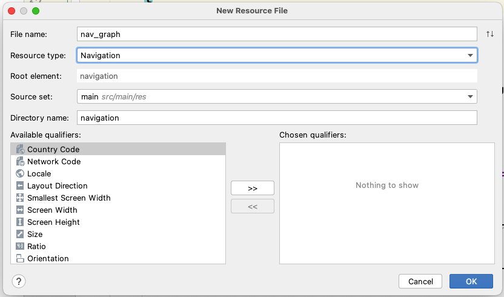
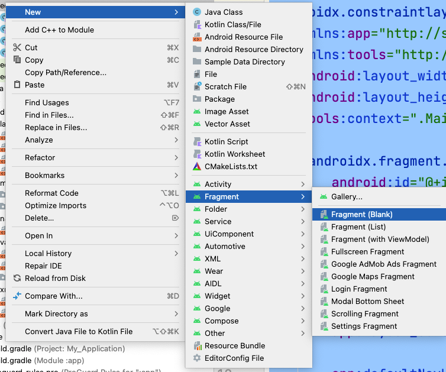
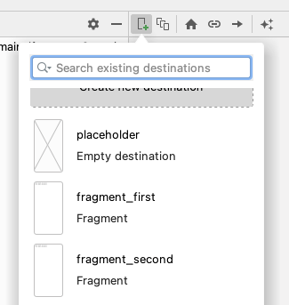
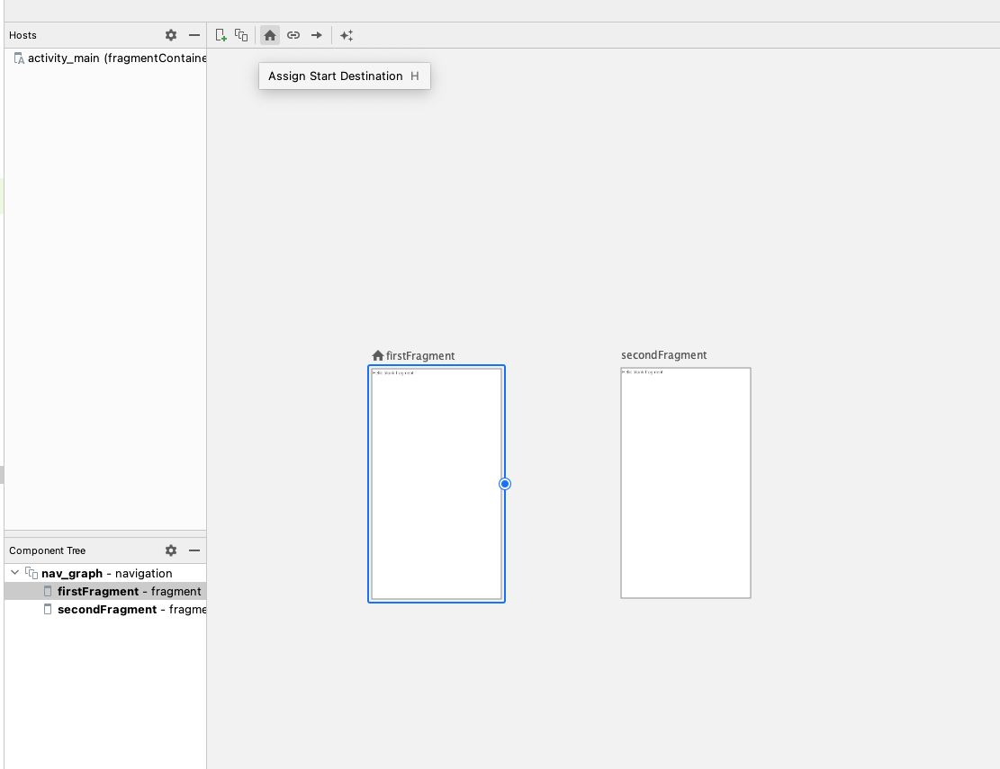
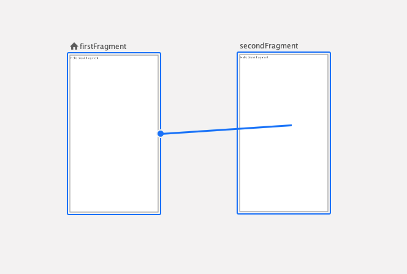
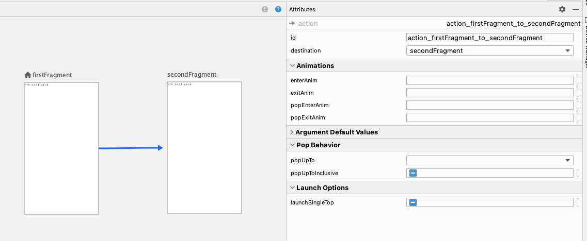
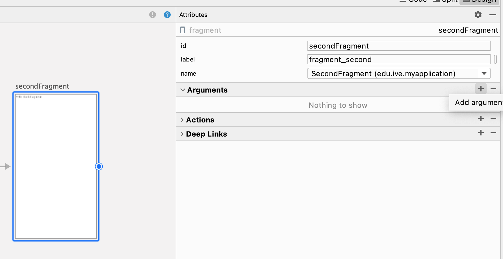
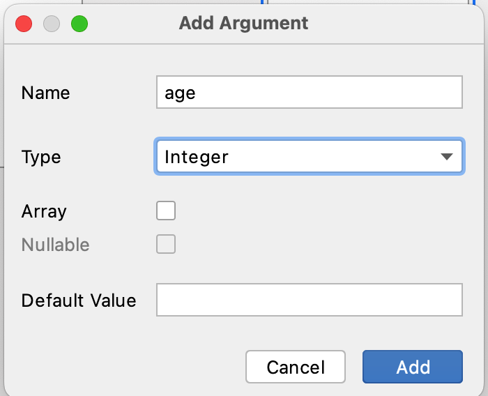

# Android Navigation

## Navigation

Navigation refers to the interactions that allow users to navigate across, into, and back out from the different pieces of content within your app. Android Jetpack's Navigation component helps you implement navigation, from simple button clicks to more complex patterns, such as app bars and the navigation drawer. The Navigation component also ensures a consistent and predictable user experience by adhering to an established set of principles.

Follow steps below to prepare the nav_graph xml file:

1. Start a new Android Studio project and name it 'NavigationEx' (Template: Empty Activity). At the project view, right-click the `res` folder and select `New > Android Resource File`.

2. In the New Resource File, type `nav_graph` for the File name, select `Navigation` for the Resource type:


3. Rich-click the src package, create two new fragments (Black Fragment), name them `FirstFragment` and `SecondFragment` respectively :



4. Edit the `nav_graph` xml file, add First Fragment and Second Fragment into the Navigation Graph. 



5. Select the First Fragment and make it the start destination. (The house icon)



6. Drag an action from First Fragment to Second Fragment, select create action, and name its it as `action_firstFragment_to_secondFragment`




8. Go to `activity_main`, add a NavHostFragment into the activity.

```xml
<?xml version="1.0" encoding="utf-8"?>
<androidx.constraintlayout.widget.ConstraintLayout xmlns:android="http://schemas.android.com/apk/res/android"
    xmlns:app="http://schemas.android.com/apk/res-auto"
    xmlns:tools="http://schemas.android.com/tools"
    android:layout_width="match_parent"
    android:layout_height="match_parent"
    tools:context=".MainActivity">

    <androidx.fragment.app.FragmentContainerView
        android:id="@+id/fragmentContainerView"
        android:name="androidx.navigation.fragment.NavHostFragment"
        android:layout_width="0dp"
        android:layout_height="0dp"
        app:layout_constraintLeft_toLeftOf="parent"
        app:layout_constraintRight_toRightOf="parent"
        app:layout_constraintTop_toTopOf="parent"
        app:layout_constraintBottom_toBottomOf="parent"

        app:defaultNavHost="true"
        app:navGraph="@navigation/nav_graph" />

</androidx.constraintlayout.widget.ConstraintLayout>
```

Build and run the application. You can see the launching activity prompts with the first fragment.

9. Go to `fragmnet_first`, revise the user interface as below.

```xml
<?xml version="1.0" encoding="utf-8"?>
<androidx.constraintlayout.widget.ConstraintLayout xmlns:android="http://schemas.android.com/apk/res/android"
    xmlns:app="http://schemas.android.com/apk/res-auto"
    xmlns:tools="http://schemas.android.com/tools"
    android:id="@+id/frameLayout"
    android:layout_width="match_parent"
    android:layout_height="match_parent"
    tools:context=".FirstFragment">

    <!-- TODO: Update blank fragment layout -->

    <Button
        android:id="@+id/button"
        android:layout_width="wrap_content"
        android:layout_height="wrap_content"
        android:text="Button"
        app:layout_constraintBottom_toBottomOf="parent"
        app:layout_constraintEnd_toEndOf="parent"
        app:layout_constraintStart_toStartOf="parent"
        app:layout_constraintTop_toTopOf="parent" />

</androidx.constraintlayout.widget.ConstraintLayout>
```

10. In FirstFragment.kt, setup the navigation within the `onCreateView` function.
    
    ```kotlin
    override fun onCreateView(
        inflater: LayoutInflater, container: ViewGroup?,
        savedInstanceState: Bundle?
    ): View? {
        // Inflate the layout for this fragment
        val view : View = inflater.inflate(R.layout.fragment_first, container, false)
        val button  = view.findViewById<Button>(R.id.button)
        button.setOnClickListener(object : View.OnClickListener {
            override fun onClick(view: View) {
                view.findNavController().navigate(R.id.action_firstFragment_to_secondFragment)
            }
        })
        return view
    }
    ```
   
11. Run the app, then click the 'Button' button. Check out the navigation.

    
12. At nav_graph.xml, select the Second Fragment and setup a argument in properties panel named `age`, and set its type to `Integer`.
 



13. To implement pass data from one destination to another destination, we can either use `SafeArgs` plugin or `Bundle`. At the `onCreateView` function. At `FirstFragment.kt`, add the following code to create a bundle and put it into the `navigate` function.
    
    ```kotlin
    override fun onCreateView(
        inflater: LayoutInflater, container: ViewGroup?,
        savedInstanceState: Bundle?
    ): View? {
        // Inflate the layout for this fragment
        val view : View = inflater.inflate(R.layout.fragment_first, container, false)
        val button  = view.findViewById<Button>(R.id.button)
        button.setOnClickListener(object : View.OnClickListener {
            override fun onClick(view: View) {
                val bundle = bundleOf("age" to 100)
                view.findNavController().navigate(R.id.action_firstFragment_to_secondFragment, bundle)
            }
        })
        return view
    }
    ```

14. In Second Fragment's (`SecondFragment.kt`) `onResume` Function, get the data using the built-in `argument` attribute and show it using a `Toast`

    ```kotlin
    override fun onResume() {
        super.onResume()
        val age = this.arguments?.getInt("age")
        Toast.makeText(this.activity, ${age}, Toast.LENGTH_LONG).show()
    }
    ```
15. Run the app again.
