# Testing

When you create your apps, you need to make sure it works as expected. The ways we have used in the past to do this is to use `Log.d()` to produce some results. What we can also do is to use the [Assert](http://developer.android.com/reference/junit/framework/Assert.html) class. But to test properly, we need to write testing classes. 

<!--http://english.stackexchange.com/questions/174017/is-this-correct-let-me-know-once-you-finish-->
<!--https://books.google.com/ngrams/graph?content=once+you+finish%2Conce+you+have+finished%2Cwhen+you+finish%2Cwhen+you+have+finished&year_start=1940&year_end=2000&corpus=15&smoothing=3&share=&direct_url=t1%3B%2Conce%20you%20finish%3B%2Cc0%3B.t1%3B%2Conce%20you%20have%20finished%3B%2Cc0%3B.t1%3B%2Cwhen%20you%20finish%3B%2Cc0%3B.t1%3B%2Cwhen%20you%20have%20finished%3B%2Cc0-->

As a simple example, consider the following class (example taken from [JUnit introduction](https://github.com/junit-team/junit/wiki/Getting-started))

```kotlin
class Calculator {
    fun evaluate(expression: String): Int {
        var sum = 0
        for (summand in expression.split("\\+".toRegex()).dropLastWhile { it.isEmpty() }
            .toTypedArray()) sum += Integer.valueOf(summand)
        return sum
    }
}
```

To check if it works properly or not we'll need to try it out. Put simply, we'll run the class with some string inputs such as `"1+2+3"` and see if the output is `6`. Put this in the context of JUnit testing, we have

```kotlin
import org.junit.Assert.*
import org.junit.Test

class CalculatorTest {

    @Test
    fun evaluatesExpression() {
        val calculator = Calculator()
        val sum = calculator.evaluate("1+2+3")
        assertEquals(6, sum)
    }
}
```

Now this explains the idea of testing. Instead of JUnit, you can find other tools/packages available for Kotlin. But JUnit is what we need for Android.

> The latest version of JUnit is 4, but some online tutorials still use JUnit 3. A lot of syntax between the two versions are the same. But the differences are also huge. The most noticeable difference is the use of annotations in JUnit 4 such as `@Before` and `@after` in replacement of `setup()` and `tearDown()` in JUnit 3. Click to read a nice blog on [JUnit 4 annotations](http://javarevisited.blogspot.co.uk/2012/06/junit4-annotations-test-examples-and.html).

> Some tutorials use `@Before setup()` in the code. Once you see this you know straightaway it's JUnit 4. Here `setup()` is just a name, not an overriding method anymore.

## Lab 1 Unit testing

There're two types of testing in Android depending on whether an Android device (physical or AVD) is needed or not: 

1. Local unit tests run on a local JVM on your development machine, and doesn't require Android devices; 
2. The other type of testing is called instrumented testing, which requires an Android device, as will be discussed later. 

At runtime, local unit tests will be executed against a modified version of android.jar where all final modifiers have been stripped off. For more info on this, read [the official Android user guide on testing](https://developer.android.com/studio/test/index.html).
<!--http://tools.android.com/tech-docs/unit-testing-support-->


### Default app and default tests

Let's have a look at the default tests generated by Android Studio

1. Create a new project called 'My Tests' using all default options. 
2. In the Project tool window, click on app ==> java. You'll see there're three sub-folders (packages) and each has an auto-generated class
    
    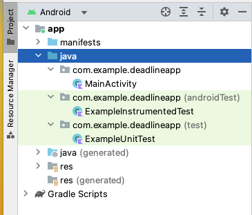
    
    As we know already, Gradle uses conventions to build the system. The convention here is this:
    * Your 'main' codes and resources are saved in a folder called 'app/src/main'.
    * Your local unit tests are saved in a folder called 'app/src/test'.
    * Your instrumentation tests are saved in a folder called 'app/src/androidTest'.
    
    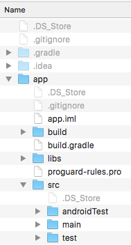
    
3. Double-click to open ExampleUnitTests.kt, what you'll see is the following
    
    ```kotlin
    class ExampleUnitTest {
        @Test
        fun addition_isCorrect() {
            assertEquals(4, 2 + 2)
        }
    }
    ```
    
    Note the use of JUnit classes. Also, here we used `import static` statement to import static members.
    
4. Right-click on ExampleUnitTest and select Run 'ExampleUnitTest'.
    
5. Now your Run tool window will look similar to this
    
    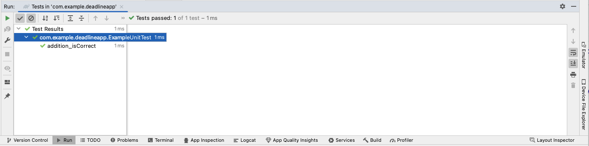
    
    * The color of the status bar indicates whether the tests have passed successfully. Green for pass, red for fail.
    * The left-hand pane shows the tree view of all tests within the current run/debug configuration.
    * The toolbar provides controls that enable you to monitor the tests and analyze results. Notice the export icon (the one to the right of down-arrow), if you click it you'll be able to export the test results.
    
    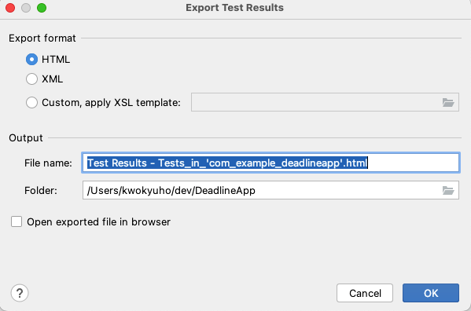
    
    > In some online tutorials, you'll see that they talk about HTML reports generated in build/reports folder. Forget about it, those have been deprecated!

Now you have just finished your first ever tests!

### The 'Deadline' app

To do some testing exercises, we'll need to create an app. Here we create an app that calculates time left until 6000CEM assignment deadline (how exciting!). The idea of the app is that given the current date in the format of dd/mm/yy, the app should 

* Display how many days left until coursework submission once you click 'Update'.
    
    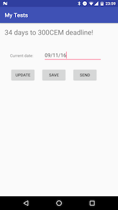
    
* Save the current date to SharedPreferences once you click 'Save'.
* Send current date to new activity once you click 'Send'.

    

Follow steps below to create the app. This is a simple app and should be self-explanatory.

1. Open activity_main.xml, delete the auto-generated TextView and insert the following:
    
    ```xml
    <?xml version="1.0" encoding="utf-8"?>
    <RelativeLayout xmlns:android="http://schemas.android.com/apk/res/android"
        xmlns:app="http://schemas.android.com/apk/res-auto"
        xmlns:tools="http://schemas.android.com/tools"
        android:layout_width="match_parent"
        android:layout_height="match_parent"
        tools:context=".MainActivity">
    
        <TextView
            android:id="@+id/textView"
            android:layout_width="wrap_content"
            android:layout_height="wrap_content"
            android:text="Hi, there!"
            android:textSize="24sp" />
    
        <TextView
            android:id="@+id/textView1"
            android:layout_width="wrap_content"
            android:layout_height="wrap_content"
            android:layout_alignLeft="@id/textView"
            android:layout_below="@id/textView"
            android:layout_marginLeft="19dp"
            android:layout_marginTop="56dp"
            android:text="Current date:"
            android:textAppearance="?android:attr/textAppearanceSmall" />
    
        <EditText
            android:id="@+id/editText"
            android:layout_width="wrap_content"
            android:layout_height="wrap_content"
            android:layout_alignBaseline="@id/textView1"
            android:layout_alignBottom="@id/textView1"
            android:layout_marginLeft="36dp"
            android:layout_marginRight="40dp"
            android:layout_toRightOf="@id/textView1"
            android:ems="10"
            android:hint="dd/mm/yy"
            android:inputType="date" />
    
        <Button
            android:id="@+id/buttonUpdate"
            android:layout_width="wrap_content"
            android:layout_height="wrap_content"
            android:layout_alignParentLeft="true"
            android:layout_below="@+id/editText"
            android:layout_marginLeft="20dp"
            android:layout_marginTop="22dp"
            android:onClick="onUpdateClick"
            android:text="Update" />
    
        <Button
            android:id="@+id/buttonSave"
            android:layout_width="wrap_content"
            android:layout_height="wrap_content"
            android:layout_alignBottom="@+id/buttonUpdate"
            android:layout_centerHorizontal="true"
            android:layout_marginLeft="20dp"
            android:layout_toRightOf="@+id/buttonUpdate"
            android:onClick="onSaveClick"
            android:text="Save" />
    
        <Button
            android:id="@+id/buttonSend"
            android:layout_width="wrap_content"
            android:layout_height="wrap_content"
            android:layout_alignBottom="@id/buttonUpdate"
            android:layout_centerHorizontal="true"
            android:layout_marginLeft="20dp"
            android:layout_toRightOf="@id/buttonSave"
            android:onClick="onSendClick"
            android:text="Send" />
    
    </RelativeLayout>
    ```
    
2. Create a new Deadline class, and insert the following into Deadline.kt
    
    ```kotlin
    import android.app.Activity
    
    import android.content.Context
    import java.text.DateFormat
    import java.text.ParseException
    import java.text.SimpleDateFormat
    import java.util.*
    
    class Deadline {
        private var date: Date? = null
        private var context: Context? = null
    
        constructor(date: String?, context: Context?) {
            try {
                this.date = dateFormat.parse(date)
            } catch (e: ParseException) {
                e.printStackTrace()
            }
            this.context = context
        }
    
        constructor(date: String?) {
            try {
                this.date = dateFormat.parse(date)
            } catch (e: ParseException) {
                e.printStackTrace()
            }
        }
    
        fun calculate(): Int {
            val submission: Date
            return try {
                submission = dateFormat.parse("31/03/23")
                ((submission.time - date!!.time) / (1000 * 60 * 60 * 24)).toInt()
            } catch (e: ParseException) {
                e.printStackTrace()
                -1
            }
        }
    
        fun save(): Boolean {
            val sharedPreferences = (context as Activity?)!!.getPreferences(Context.MODE_PRIVATE)
            val editor = sharedPreferences.edit()
            editor.putString(DATE_KEY, dateFormat.format(date))
            return editor.commit()
        }
    
        companion object {
            private val dateFormat: DateFormat = SimpleDateFormat("dd/MM/yy")
            private const val DATE_KEY = "dateKey"
        }
    }
    ```
    
    This class has two methods. The `calculate()` method calculates the time difference in days between the input and the submission deadline which is 31/03/23. The `save()` method save the date data in a SharedPreferences xml file.
    
3. Open MainActivity.kt, insert the following into the class:
    
    ```kotlin
    
    companion object {
        const val DAYS_KEY = "DAYS_KEY"
    }

    private lateinit var textView: TextView
    private lateinit var editText: EditText
    private lateinit var deadline: Deadline
    fun onUpdateClick(v: View?) {
        deadline = Deadline(editText.text.toString(), this)
        textView.text = deadline.calculate().toString() + " days to 300CEM deadline!"
    }

    fun onSaveClick(v: View?) {
        deadline = Deadline(editText.text.toString(), this)
        deadline.save()
    }

    fun onSendClick(v: View?) {
        deadline = Deadline(editText.text.toString(), this)
        val intent = Intent(this, DisplayActivity::class.java)
        intent.putExtra(DAYS_KEY, deadline.calculate())
        startActivity(intent)
    }
    ```
    
    Insert the following into `onCreate()` method:
    
    ```kotlin
    editText = findViewById<EditText>(R.id.editText) 
    textView = findViewById<TextView>(R.id.textView)
    ```
    
4. Create a new empty Activity called DisplayActivity. Insert the following into the ConstraintLayout in activity_display.xml
    
    ```xml
    <TextView
        android:id="@+id/textView"
        android:layout_width="match_parent"
        android:layout_height="wrap_content"
        android:text="placeholder"
        android:textSize="50sp"
        app:layout_constraintBottom_toBottomOf="parent"
        app:layout_constraintEnd_toEndOf="parent"
        app:layout_constraintStart_toStartOf="parent"
        app:layout_constraintTop_toTopOf="parent" />
    ```
    
5. Open DisplayActivity.kt, insert the following code into the `onCreate()` method, just below `setContentView()`
    
    ```kotlin
    val textView = findViewById<TextView>(R.id.textView)
    val intent = intent
    val daysLeft = intent.getIntExtra(MainActivity.DAYS_KEY, 0)
    textView.text = Integer.toString(daysLeft + 1) + " days until Apr 2023!"
    ```

### Local unit tests

The critical part of the app above is the capability to calculate time differences. Now let's design a test for this.

1. Open Deadline.kt, navigate your cursor to be within the class body, right-click and select Go To ==> Test.
    
    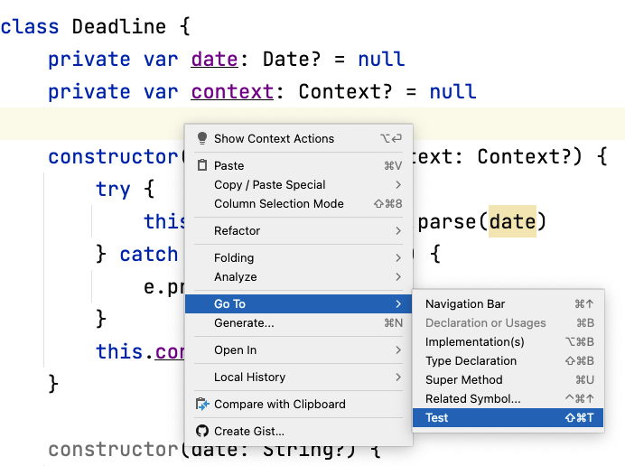
    
2. In the window that pops up, select Create New Test. Then in the Create Test window check the 'calculate()' checkbox, click OK.
    
    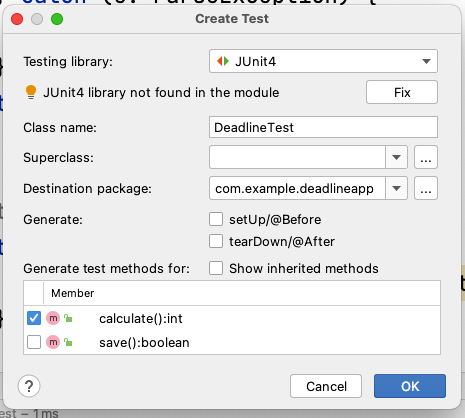
    
3. Choose the 'test' folder in the Directory Structure tab, and click OK. You just created a testing class for Deadline, and this new class appears in the test package.
    
    
    
4. Insert the following into `calculate()`
    
    ```kotlin
    val deadline = Deadline("31/03/23");
    assertEquals(deadline.calculate(), 0);
    ```
    
    Now your DeadlineTest class looks like the following:
    
    ```kotlin
    class DeadlineTest {
    
        @Test
        fun calculate() {
            val deadline = Deadline("31/03/23");
            assertEquals(deadline.calculate(), 0);
        }
    }
    ```
    
    The test itself is a public class. Here we use an annotation to mark the actual test we want to run, which is a member method in that class. We then simply declare a new instance of the class that we know the calculation result.
    
5. If you right-click on the DeadlineTest in Project tool window and choose Run 'DeadlineTest', you'll see something similar to below:
    
    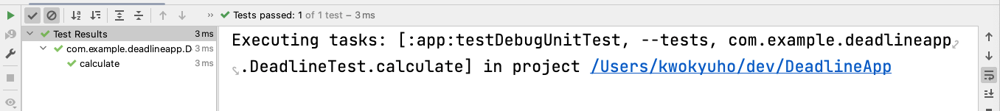
    
    The test runs on local JVMs and finishes without any error. If you change assertion to `assertEquals(deadline.calculate(), 2)` and run it, what happens?

### Local mocked unit tests

The test we did above used the Deadline constructor that doesn't require the Context input parameter. This is because Context is Android dependent we cannot run a test on local JVMs. The way to get around this, i.e. to test Android SDK dependent code, is to use a mocking framework called Mockito.

1. Open build.gradle (Module: app), insert Mockito and Hamcrest dependencies into the dependencies configuration block (after line `testImplementation 'junit:junit:4.13.2'` if exists already)
    
    ```xml
    testImplementation 'junit:junit:4.13.2'
    testImplementation 'com.android.support:support-annotations:28.0.0'
    testImplementation 'com.android.support.test:rules:1.0.2'
    testImplementation 'org.mockito:mockito-core:3.+'
    testImplementation 'org.hamcrest:hamcrest-library:2.2'
    ```
    
    Mockito is a mocking framework, and Hamcrest is a package to make testing more readable. You'll see both later. Click 'Sync Now' after making changes.
    
2. Modify your DeadlineTest.kt so it looks like the following (If you edit the code manually you'll probably understand better than simply copy/paste)
    
    ```kotlin
    @SmallTest
    @RunWith(MockitoJUnitRunner::class)
    class DeadlineTest {
        @Mock
        lateinit var context: Context
    
        @Mock
        lateinit var activity: Activity
    
        @Mock
        lateinit  var sharedPreferences: SharedPreferences
    
        @Mock
        lateinit var editor: SharedPreferences.Editor
        lateinit private var deadline: Deadline
    
        @Test
        @Throws(Exception::class)
        fun testCalculate() {
            val localDeadline = Deadline("31/03/23")
            Assert.assertEquals(localDeadline.calculate().toLong(), 0)
        }
    
        @Test
        @Throws(Exception::class)
        fun testCalculate2() {
            val anotherDeadline = Deadline("30/03/23", context)
            MatcherAssert.assertThat(
                "check if time interval is calculated properly",
                anotherDeadline.calculate(),
                Matchers.`is`(IsEqual.equalTo(1))
            )
        }
    
        @Before
        fun initTests() {
            deadline = Deadline("10/12/16", activity)
        }
    
        @Test
        @Throws(Exception::class)
        fun testSave() {
            Mockito.`when`(activity.getPreferences(Context.MODE_PRIVATE))
                .thenReturn(sharedPreferences)
            Mockito.`when`(sharedPreferences.edit()).thenReturn(editor)
            Mockito.`when`(editor.commit()).thenReturn(true)
            MatcherAssert.assertThat(deadline.save(), Matchers.`is`(true))
        }
    }
    ```
    
    There're quite a lot going on here:
    * `@SmallTest` is a way to classify different tests, as you might have guessed, so later on tests can be grouped using filters for example SmallTests only. However, unfortunately, it's not very clear from Android Studio documentation how this can be done through GUI. Instructions using command line options can be found on [Test from the Command Line](https://developer.android.com/studio/test/command-line.html) manual page and [documentation on AndroidJUnitRunner](https://developer.android.com/reference/android/support/test/runner/AndroidJUnitRunner.html). Read this [StackOverflow page](http://stackoverflow.com/questions/4671923/what-is-the-purpose-of-smalltest-mediumtest-and-largetest-annotations-in-an) for the differences among SmallTest, MediumTest and LargeTest.
    
    * `@RunWith` line specifies the Runner of the current testing class. A Runner is merely another class that is designed to perform some specific functions. An example Runner is something like below (example from [TutorialsPoint](http://www.tutorialspoint.com/junit/junit_suite_test.htm))
    
    ```java
    public class TestRunner {
        public static void main(String[] args) {
           Result result = JUnitCore.runClasses(JunitTestSuite.class);
           for (Failure failure : result.getFailures()) {
              System.out.println(failure.toString());
           }
           System.out.println(result.wasSuccessful());
        }
    }
    ```
    The default runner in the current project is configured in 'build.gradle(Module:app)' file using line
    
    ```xml
    testInstrumentationRunner "android.support.test.runner.AndroidJUnitRunner"
    ```
    
    However, for this current class, MockitoJUnitRunner will mock our dependencies in Android system.
    
    * `@Mock` line indicates a variable is being mocked. When being mocked, all methods of the class throw exceptions. This is because the android.jar file that is used to run unit tests does not contain any actual code. For more details on this, read [Mock Android dependencies section](https://developer.android.com/training/testing/unit-testing/local-unit-tests.html) on the official website.
    * `@Before` line indicates the code block will be invoked before each test. You should use this annotation to specify a block of code with test setup operations. Strictly speaking, we should use `@BeforeClass` here to initialize a static variable, but since it's a small test after all it won't make much difference. Read [Stack Overflow discussions on the difference between @Before and @BeforeClass](http://stackoverflow.com/questions/20295578/difference-between-before-and-beforeclass), and [Getting Started with Testing](https://developer.android.com/training/testing/start/index.html) on the official website for a full list of annotations available.
    * In `testSave()` method we used `when().thenReturn()` to mock the behavior of mocked classes. This is because context/activity etc. are all mocked objects, which don't contain any actual methods. You'll need to supply some results once these methods are called. The purpose of this test is to demo `when().thenReturn()` method. However, because of the way we design it, this test is guaranteed to pass.
    * Note in line `assertThat("check if time interval is calculated properly", deadline.calculate(), is(equalTo(2)))` we used `assertThat`, `is` and `equalTo` from Hamcrest to increase readability. But this is essentially the same as `assertEquals(deadline.calculate(), 2)`. Here `is` and `equalTo` are both matchers.
    
3. Right-click and run DeadlineTest, then export the results to HTML. Locate and open that HTML file, you'll see something similar to below:
    
    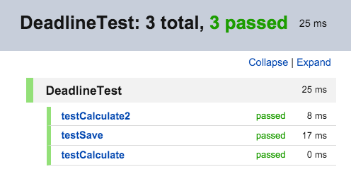

## Lab 2 Instrumented testing

Tests we've done so far run on local JVM and don't require Android devices, either real or virtual. If you need to access Android system resources such as Context you need to test your app on an actual device or AVD. This type of tests is called Instrumented tests.

### Instrumented unit tests

Follow steps below to create an instrumented unit test:

1. Duplicate the MyTests project created earlier and name the new project MyTests2, and open this new project in Android Studio. By default, the system generates an instrumented test class already called ExampleInstrumentedTest. In the Project tool window, locate this ExampleInstrumentedTest class and right-click on it, select Run 'ExampleInstrumentedT...' you'll see in the Run tool window it shows you a message saying 'All Tests Passed'.
    
    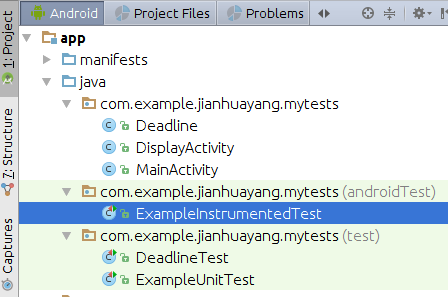
    
2. open build.gradle (Module: app) file, insert following androidTestCompile dependencies into the dependencies block
    
    ```xml
    androidTestImplementation 'androidx.test.ext:junit:1.1.5'
    androidTestImplementation 'androidx.test.espresso:espresso-core:3.5.1'
    androidTestImplementation 'com.android.support.test:rules:1.0.2'
    androidTestImplementation 'org.hamcrest:hamcrest-library:2.2'
    androidTestImplementation 'com.android.support.test:runner:1.0.2'
    androidTestImplementation 'com.android.support:support-annotations:28.0.0'
    ```
    
    In previous exercises on 'unit test' you inserted dependency configurations for testCompile. So what are the differences between testCompile and androidTestCompile? Simply testCompile is the configuration for unit tests (those located in src/test) and androidTestCompile is used for the test API (that located in src/androidTest). Read this [Stack Overflow discussions on testCompile and androidTestCompile](http://stackoverflow.com/questions/29021331/confused-about-testcompile-and-androidtestcompile-in-android-gradle).
    
3. Double check that you have the following line in the defaultConfig block
    
    ```xml
    testInstrumentationRunner "android.support.test.runner.AndroidJUnitRunner"
    ```
    
    Note that some online tutorials use InstrumentationTestRunner instead. This InstrumentationTestRunner class is now deprecated. More on this in 'Lab 3'.
    
3. Right-click on the androidTest package and create a new class called InstrumentedDeadlineTest
    
    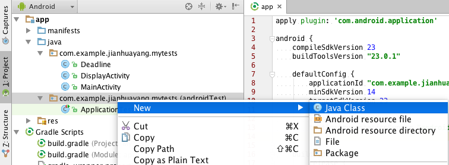
    
4. Open InstrumentedDeadlineTest.kt, replace contents with the following
    
    ```kotlin
    @RunWith(AndroidJUnit4::class)
    @SmallTest
    class InstrumentedDeadlineTest {
        private var deadline: Deadline? = null
        @Before
        fun initTests() {
            val context = InstrumentationRegistry.getInstrumentation().targetContext
            deadline = Deadline("31/03/23", context)
        }
    
        @Test
        fun testCalculate() {
            Log.d("actual_results", Integer.toString(deadline!!.calculate()))
            MatcherAssert.assertThat(deadline!!.calculate(), Matchers.`is`(IsEqual.equalTo(0)))
        }
    }
    ```
    
    As you can see we don't need to mock anything anymore. We can use some system resources such as `InstrumentationRegistry` and `Log`. Basically, Android instrumentation is a set of control methods or 'hooks' in the Android system. With Android instrumentation, you can invoke for example activity callback methods in your test code. This gives you fine control of everything. For more details on instrumentation, read this [Android docs backed up by MIT](https://stuff.mit.edu/afs/sipb/project/android/docs/tools/testing/testing_android.html#Instrumentation).
    
    However, remember instrumented tests are still unit tests, which means the system doesn't start the actual app and so it doesn't have access to things like activity methods such as `findViewById()`. Another thing to note here is that AndroidJUnit4.class is an [aliase of the current default Android JUnit 4 class runner for future-proofing](). That means at this moment (until the release of JUnit 5) you can safely delete line `@RunWith(AndroidJUnit4.class)` and your code will still run.
    
5. If you right-click the class and run, you'll see that all tests are passed. In addition, in the logcat tool window, you'll see the actual log message. 
    
    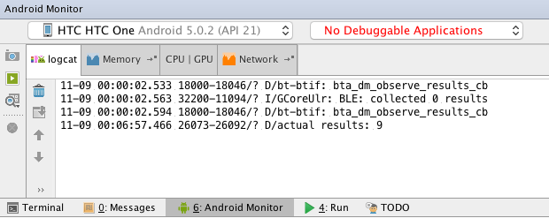
    
    You've probably noticed that instrumented tests run slower than local JUnit tests that run on JVM. This is one of the advantages of local unit tests.

### UI testing using Espresso

The Espresso testing framework, provided by the Android Testing Support Library, provides APIs for writing UI tests to simulate user interactions within a single target app. One advantage of Espresso is that it detects when the main thread is idle, so it is able to run your test commands at the appropriate time, improving the reliability of your tests. In addition, with the help of tools such as Espresso , developer rarely has to use the instrumentation API directly. For more info on this, read [Developing Android unit and instrumentation tests Tutorial on Vogella](http://www.vogella.com/tutorials/AndroidTesting/article.html).


1. Please refer to your lecturer's demonstration

